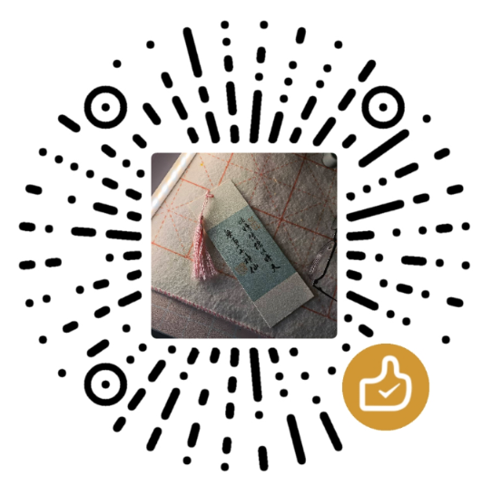

# Hello~I am KicamonIce

<picture decoding="async" loading="lazy">

</picture>

•
<b><a href="https://space.bilibili.com/389928486"> BiliBili</a></b>
•
<b><a href="https://www.cnblogs.com/KicamonIce/">Blog</a></b>
•
<b><a href="https://codeforces.com/profile/Kicamon">Codeforces</a></b>
•
<b><a href="mailto:kicamonice1532931259@gmail.com">Email me</a></b>
•

---

##  [ACMer](https://github.com/Kicamon/Algorithm)
- my algo code and algo templates: [Kicamon/Algorithm](https://github.com/Kicamon/Algorithm)

##  [Arch User](https://github.com/Kicamon/dotfile)
- my dotfile: [Kicamon/dotfile](https://github.com/Kicamon/dotfile)
- my wallpaper: [Kicamon/wallpaper](https://github.com/Kicamon/wallpaper)

##  [Law Student](https://github.com/Kicamon/Note/blob/master/wiki/index.md)
- my law note: [Law Note](https://github.com/Kicamon/Note/blob/master/wiki/index.md)

##  [All My Love](https://github.com/Kicamon/Kicamon.github.io)
- my law note: [All My Love](http://kicamon.love/)

##  [Vimer](https://github.com/Kicamon/nvim)

- my config: [Kicamon/nvim](https://github.com/Kicamon/nvim)
- my config wrote with vim script: [Kicamon/nvim-vim](https://github.com/Kicamon/nvim-vim)
- im switch for Chinese: [Kicamon/im-switch.nvim](https://github.com/Kicamon/im-switch.nvim)
- colorscheme: [Kicamon/gruvbox.nvim](https://github.com/Kicamon/gruvbox.nvim)
- statusline and tabline: [Kicamon/SimpleLine.nvim](https://github.com/Kicamon/SimpleLine.nvim)
- ranger: [Kicamon/ranger.nvim](https://github.com/Kicamon/ranger.nvim)
- tools: [Kicamon/tool.nvim](https://github.com/Kicamon/tool.nvim)
- wiki: [Kicamon/wiki.nvim](https://github.com/Kicamon/wiki.nvim)
- markdown table format: [Kicamon/markdown-table-mode.nvim](https://github.com/Kicamon/markdown-table-mode.nvim)
- if you are interested in how to write nvim plugin and proficent in Chinese, you can watch this video: [Tutorial video](https://www.bilibili.com/video/BV1Qb4y1g7fU/)

## Support: Buy me a cup of coffee

    
    

