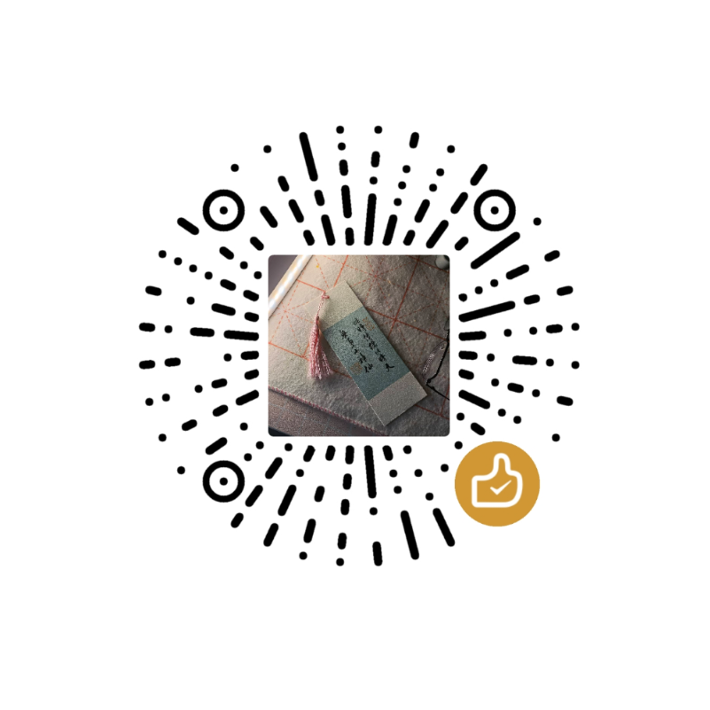

# Hello~I am KicamonIce

•
<b><a href="https://space.bilibili.com/389928486"> BiliBili</a></b>
•
<b><a href="https://juejin.cn/user/383100845819662">Blog</a></b>
•
<b><a href="https://codeforces.com/profile/Kicamon">Codeforces</a></b>
•
<b><a href="mailto:kicamonice1532931259@gmail.com">Email me</a></b>
•

<b>
Law Student
|
Vimer
|
Acmer
|
Arch User
</b>

---

##  [Law Student](https://github.com/Kicamon/Note/blob/master/wiki/index.md)
- my law note: [Law Note](https://github.com/Kicamon/Note/blob/master/wiki/index.md)

##  [Vimer](https://github.com/Kicamon/nvim)

- my config: [Kicamon/nvim](https://github.com/Kicamon/nvim)
- my config wrote with vim script: [Kicamon/nvim-vim](https://github.com/Kicamon/nvim-vim)
- im switch for Chinese: [Kicamon/im-switch.nvim](https://github.com/Kicamon/im-switch.nvim)
- colorscheme: [Kicamon/gruvbox.nvim](https://github.com/Kicamon/gruvbox.nvim)
- statusline and tabline: [Kicamon/SimpleLine.nvim](https://github.com/Kicamon/SimpleLine.nvim)

##  [ACMer](https://github.com/Kicamon/Algorithm)
- my algo code and algo templates: [Kicamon/Algorithm](https://github.com/Kicamon/Algorithm)

##  [Arch User](https://github.com/Kicamon/dotfile)
- my dotfile: [Kicamon/dotfile](https://github.com/Kicamon/dotfile)

## Support: Buy me a cup of coffee
## 
